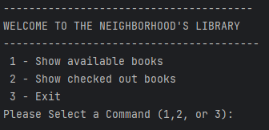
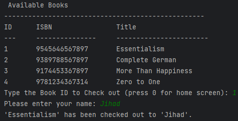
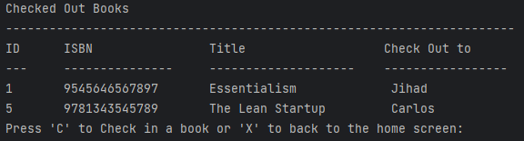
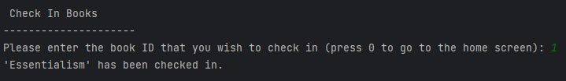
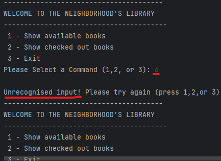
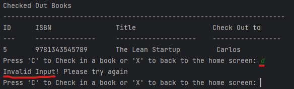

# Neighborhood Library 📚

This console application allows users to check in and check out books. 
Users have the ability to:
1. List all available books
2. Check out available books
3. List all checked out books
4. Check in books

## Interesting Code   &nbsp;

An interesting piece of code was the implementation of this Home Screen's loop. Instead of using a traditional looping mechanism, such as a `while`, `for`, or `do-while` loop, a recursive function was utilized. A recursive function is a function that calls itself repeatedly until a specific condition is met. In this application, the recursive function was used to repeat a certain set of instructions until the user exits the application. This technique may be different but I believe that it gives us the same output as of the traditonal loops. 
```java
public static void homeScreen() {
// Home Screen UI
System.out.println("---------------------------------------");
System.out.println("WELCOME TO THE NEIGHBORHOOD'S LIBRARY");
System.out.println("----------------------------------------");
System.out.println(" 1 - Show available books ");
System.out.println(" 2 - Show checked out books ");
System.out.println(" 3 - Exit ");
System.out.print("Please Select a Command (1,2, or 3): ");
selection = scanner.nextInt(); // registering the users selection
scanner.nextLine();
//Switch cases
switch (selection) {
// Calling 'availableBooks' function
case 1:availableBooks();break;
// Calling 'checkedOutBooks' function 
case 2:checkedOutBooks(); break; 
// Exits the program and stops the recursive function
case 3: {System.out.println("Thank you for using the neighborhood's library!");System.exit(1); 
break;}
default: {
//Error message for invalid input
// Recursively calling the 'homeScreen' function
System.out.println("\nUnrecognised input! Please try again (press 1,2,or 3)");
homeScreen(); }}}
```

## CLI Screens 💻

### Home Screen



### List All Available Books




### List All Checked Out Books



### Check in Books


### Error Messages



### Error Message



## How To Use 📘

### Home Screen 
On the home screen, the user is presented with three options that can be selected by entering the corresponding integer. To view all the available books for checkout, the user should press 1. This will take the user to a screen that displays a list of all the available books. To view all the books that have been checked out and their borrowers, the user should press 2. This will take the user to a screen that displays a list of all the checked-out books and their respective borrowers. If the user wishes to exit the application, they should press 3. The application will not save any changes or progress made during the session upon exiting.

### All Available Books Screen  
On this screen, the user can view a list of all the available books for checkout. To check out a book, the user should provide the book's ID, which can be found in the screen's user interface. Once the book ID is entered, the system will verify if the book is available for checkout. If the book is available, the user will be prompted to enter their name. After entering their name, the system will update the book's status to "checked out" and associate it with the borrower's name.

###  Checked Out Books Screen 
This screen provides a list of all the books that have been checked out, along with the names of the borrowers. The user can also choose to return their checked-out books or go back to the home screen. To return a book, the user should provide the book's ID, which was given during the checkout process. The system will then update the book's status accordingly. If a book is returned successfully, it will be removed from the list of checked-out books. It is important to note that only books that have been previously checked out can be returned on this screen.

### Exiting
The user can exit the application from the home screen by pressing 3 and then enter.
